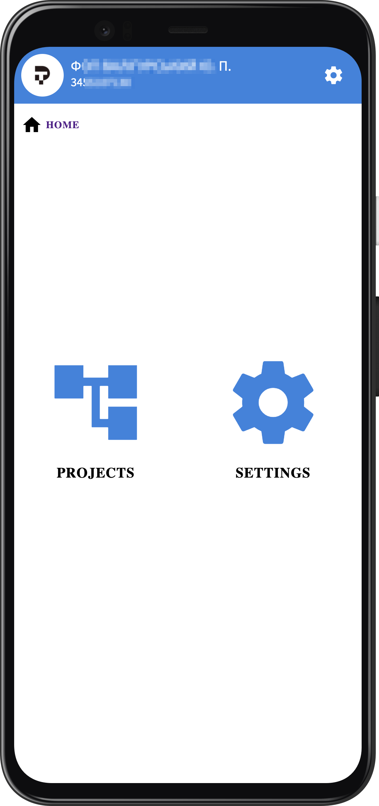
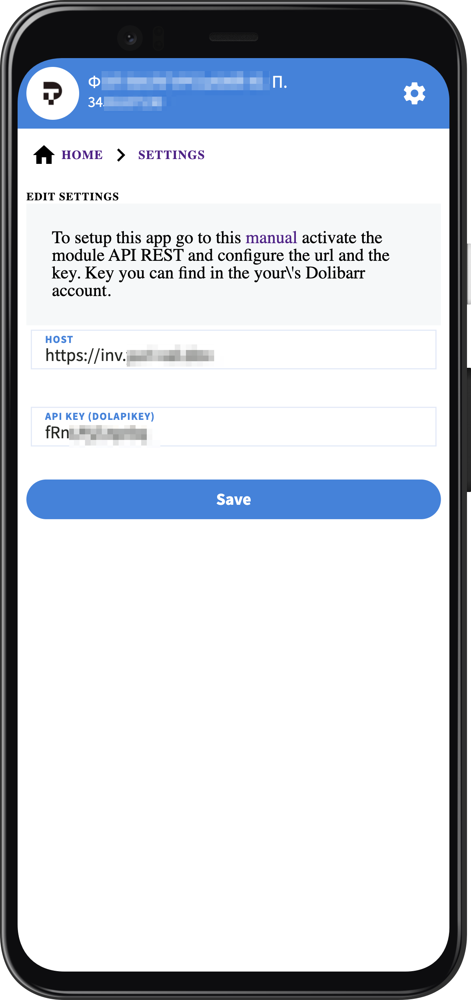
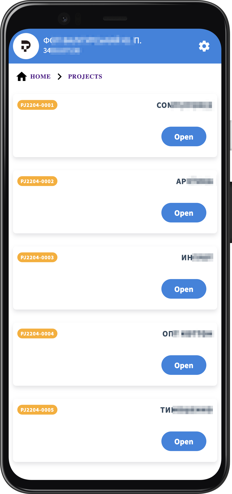
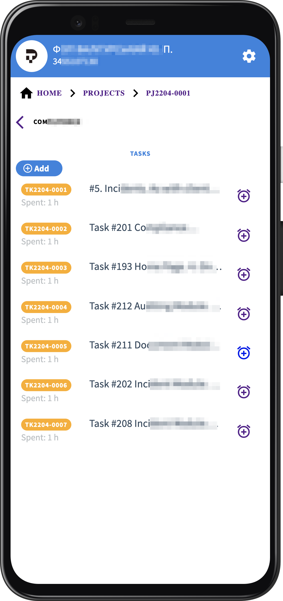
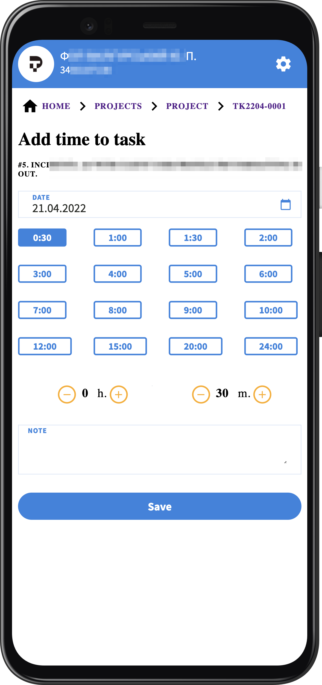
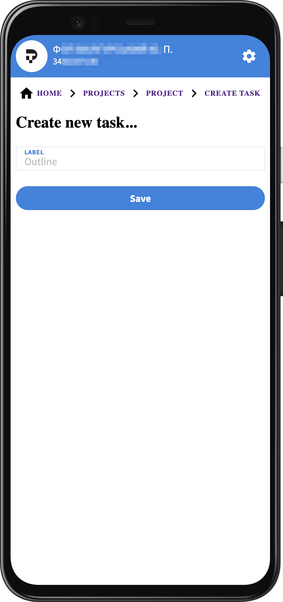

# Dolibarr Tracker

Web interface for quick time tracking by tasks in the [Dolibarr ERP](https://www.dolibarr.org/) system

## Setup Dolibarr 

1. Enable [Module Web Services API REST](https://wiki.dolibarr.org/index.php?title=Module_Web_Services_API_REST_(developer))
   - Go to Home > Setup > Modules/Applications > API/WEB SERVICES (REST SERVER)
2. Also enable next related modules:
   - PROJECTS OR LEADS
   - THIRD PARTIES
   - INVOICES
3. Get your `host`:
   - Go to Home > Setup > Modules/Applications > API/WEB SERVICES (REST SERVER)
   - Click 'cog' icon to open the settings
   - Copy your host ---> <<YOUR_HOST>>/api/index.php/explorer 
4. Get your `API key`:
   - Go to Profile > Card > Modify > Key for API (copy or generate new for copy)
5. Open Dolibarr Tracker in your browser (one of): 
   - https://yuri-val.github.io/dolibarr-tracker/ (for fast review)
   - http://localhost:3000/dolibarr-tracker/ (if you start it locally)
   - https://<<YOUR_HOST>>/dolibarr-tracker/ (if you start it on your own server)
6. Go to settings and paste your `host` and `API key`
   

## Contacts
Developer: [@yuri-val]()

Telegram: https://t.me/yuri_val

Telegram group: https://t.me/+a8uc5iafbfo1MGRi

## Features

### Home screen

<p align="center">
  
</p>

### Settings
<p align="center">
  
</p>

### Projects

<p align="center">
  
  
</p>

### Tasks
<p align="center">
  
  
</p>

## Project Setup

```sh
npm install
```

### Compile and Hot-Reload for Development

```sh
npm run dev
```

### Compile and Minify for Production

```sh
npm run build
```

### Lint with [ESLint](https://eslint.org/)

```sh
npm run lint
```
