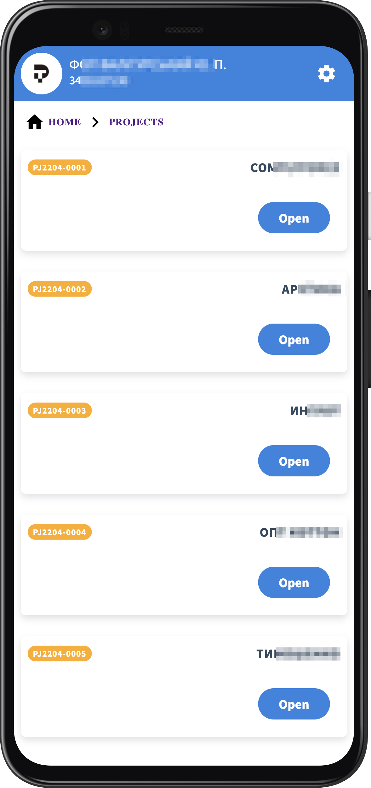

# Dolibarr Tracker

Web interface for quick time tracking by tasks in the [Dolibarr ERP](https://www.dolibarr.org/) system

## Features

### Home screen

<p align="center">
  
</p>

### Settings
<p align="center">
  
</p>

### Projects

<p align="center">
  
  
</p>

### Tasks
<p align="center">
  
  
</p>

## Project Setup

```sh
npm install
```

### Compile and Hot-Reload for Development

```sh
npm run dev
```

### Compile and Minify for Production

```sh
npm run build
```

### Lint with [ESLint](https://eslint.org/)

```sh
npm run lint
```
